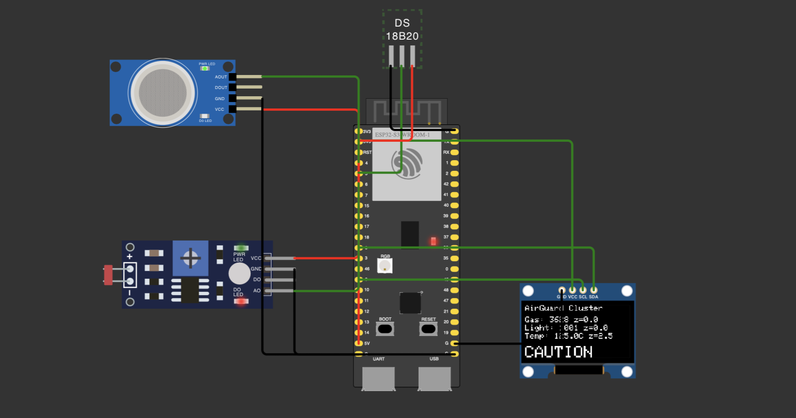
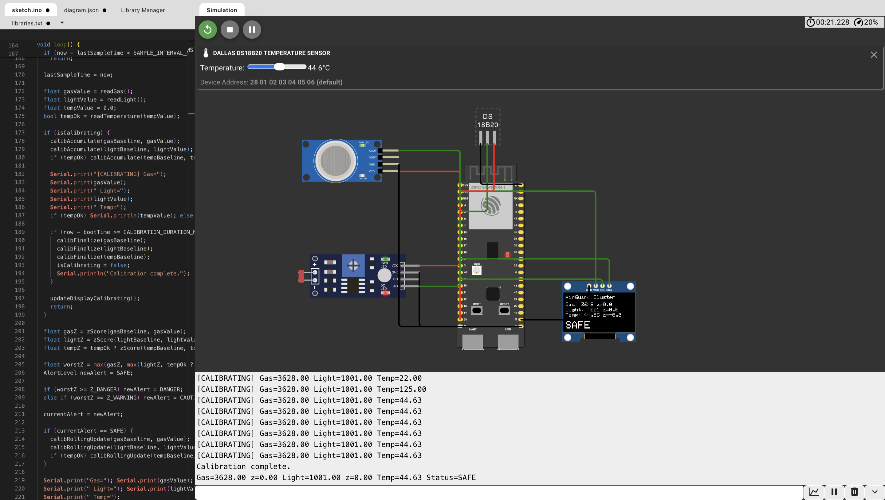
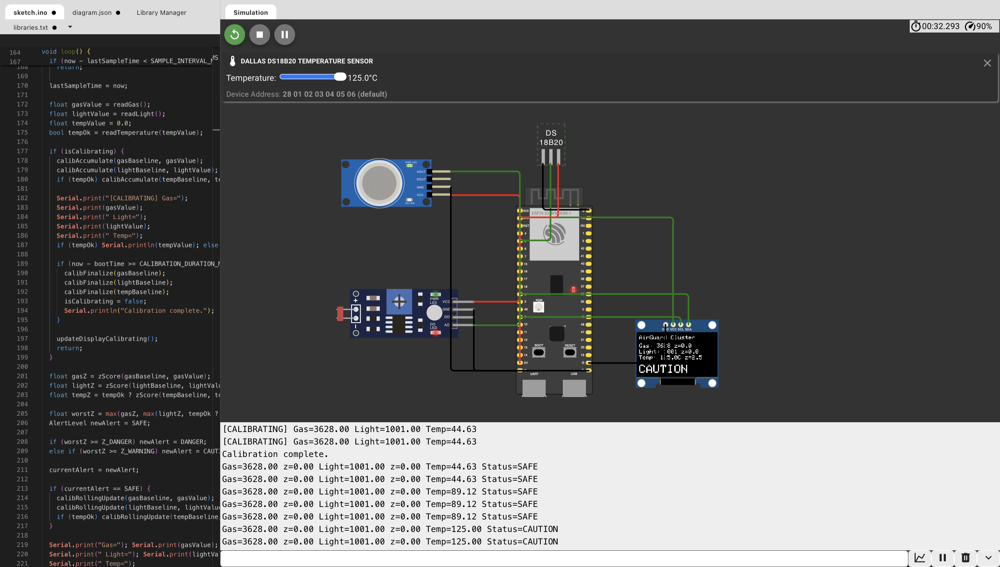

# Atoms

## Self-Calibrating Environmental Monitoring System using ESP32-S3

---

# Table of Contents

1. Introduction
2. Project Overview
3. System Architecture
4. Hardware Specifications
5. Sensor Specifications
6. Circuit Diagram
7. Working Principle
8. Statistical Anomaly Detection
9. Advanced Embedded Optimizations
10. Display & Serial Output
11. Software Libraries
12. Project Structure
13. Limitations
14. Future Improvements
15. Image References
16. Author

---

# 1. Introduction

Atoms is an embedded environmental monitoring system developed around the ESP32-S3 microcontroller. Instead of relying on manually configured thresholds, the system establishes its own environmental baseline through statistical calibration and continuously monitors for abnormal conditions using adaptive anomaly detection.

The project demonstrates how classical statistical methods can be implemented efficiently on resource-constrained embedded hardware while maintaining low memory usage and real-time operation.

Unlike many demonstration projects, Atoms intentionally avoids overstated claims regarding artificial intelligence or machine learning. Every decision is based on deterministic statistical calculations.

---

# 2. Project Overview

The system continuously monitors:

* Gas concentration
* Ambient temperature
* Ambient light intensity

After an initial calibration period, every sensor reading is compared against its learned baseline using z-score analysis.

Instead of asking,

> "Is the value above a fixed threshold?"

the firmware asks,

> "How unusual is this value compared to what has normally been observed?"

This allows the monitor to adapt naturally to different environments while remaining sensitive to genuine anomalies.

---

# 3. System Architecture

```
             +----------------+
             |   ESP32-S3     |
             +-------+--------+
                     |
      +--------------+--------------+
      |              |              |
   MQ-2          DS18B20          LDR
      |              |              |
      +--------------+--------------+
                     |
           Statistical Processing
                     |
      Mean → Variance → Z-Score → Alert
                     |
               SSD1306 OLED Display
                     |
                Serial Monitoring
```

---

# 4. Hardware Specifications

## Main Controller

| Property      | Specification                |
| ------------- | ---------------------------- |
| Board         | ESP32-S3 DevKitC-1           |
| Processor     | Xtensa LX7 Dual-Core         |
| Clock Speed   | Up to 240 MHz                |
| SRAM          | 512 KB                       |
| Flash         | External SPI Flash           |
| Wireless      | Wi-Fi + Bluetooth LE         |
| ADC           | 12-bit                       |
| Communication | I2C, SPI, UART, GPIO, 1-Wire |

---

## Pin Configuration

| Device             | ESP32-S3 Pin |
| ------------------ | ------------ |
| MQ-2 Analog Output | GPIO4        |
| DS18B20 Data       | GPIO5        |
| LDR Analog Output  | GPIO6        |
| OLED SDA           | GPIO8        |
| OLED SCL           | GPIO9        |

---

# 5. Sensor Specifications

## MQ-2 Gas Sensor

**Purpose**

Measures changes in combustible gas and smoke concentration.

**Interface**

Analog Output

**Used for**

* Smoke Detection
* LPG
* Hydrogen
* Methane
* Butane

**Output**

Analog value interpreted statistically rather than through fixed thresholds.

---

## DS18B20 Temperature Sensor

**Purpose**

Digital temperature measurement.

**Communication**

1-Wire protocol

**Advantages**

* Factory calibrated
* Digital output
* High accuracy
* Simple wiring

Only temperature is used within the anomaly detection system.

Humidity measurements were intentionally removed by replacing the earlier DHT22 with the DS18B20.

---

## LDR (Photoresistor)

**Purpose**

Measures ambient light intensity.

**Interface**

Analog Output

Used to detect sudden environmental lighting changes.

---

## SSD1306 OLED Display

| Property   | Value    |
| ---------- | -------- |
| Resolution | 128 × 64 |
| Interface  | I2C      |
| Address    | 0x3C     |

Displays

* Gas Reading
* Light Reading
* Temperature
* Z-Scores
* Current Alert Status

---

# 6. Circuit Diagram

The project wiring is defined in **diagram.json**.

### Images

**Figure 1**



Complete circuit wiring inside Wokwi.

---

**Figure 2**



Live OLED display during monitoring.

---

**Figure 3**



Serial Monitor showing sensor values and anomaly detection.
# 7. Working Principle

## Boot Calibration

Immediately after power-up the system assumes the surrounding environment is in a normal state.

For approximately **16 seconds**, sensor values are collected every **2 seconds**.

These samples are used to compute

* Mean
* Variance
* Standard Deviation

These values become the initial baseline.

---

## Continuous Monitoring

Once calibration completes:

Every sensor reading is converted into a z-score

```
z = (Current Reading - Mean) / Standard Deviation
```

This represents how unusual the current measurement is compared to historical observations.

---

## Alert Levels

| Z-Score   | Status  |
| --------- | ------- |
| < 2.0     | SAFE    |
| 2.0 – 3.5 | CAUTION |
| > 3.5     | DANGER  |

The highest z-score among all sensors determines the current system status.

---

## Adaptive Baseline

Instead of remaining fixed forever, the baseline slowly adapts using an Exponential Moving Average.

```
Mean = Mean + α(Current − Mean)
```

where

```
α = 0.01
```

This allows slow environmental drift while preventing sudden spikes from permanently affecting the baseline.

The baseline updates **only** while the system remains in the SAFE state.

---

# 8. Statistical Anomaly Detection

The firmware performs four major statistical operations.

## Mean

Average of calibration samples.

---

## Variance

Measures the spread of collected data.

---

## Standard Deviation

Square root of variance.

---

## Z-Score

Determines how far a reading is from normal.

Unlike threshold-based monitoring, this approach adapts automatically to different environments.

No artificial intelligence or machine learning techniques are used.

---

# 9. Advanced Embedded Optimizations

The firmware is optimized for resource-constrained environments and incorporates several key design patterns:

### Union Memory Layout
To minimize the RAM footprint on the ESP32-S3, the `Baseline` struct overlays variables that are mutually exclusive in time. It uses a `union` to share memory between the calibration-phase variable `M2` (used for Welford's algorithm) and the monitoring-phase variable `variance`:
```cpp
struct Baseline {
  float mean;
  union {
    float M2;       // Used ONLY during initial calibration
    float variance; // Used ONLY during live monitoring
  };
  int sampleCount;
  float alpha;
  float minStdDev;
  bool needsCalib;
};
```

### Flash Wear Protection (NVS Guard)
Sensor baselines are saved periodically (every 1 hour) to Non-Volatile Storage (NVS) using the `Preferences` library. To extend the flash memory lifespan and prevent corrupting the baseline with anomalous readings:
* Writes are completely bypassed if the current system alert status is not `SAFE`.
* Baseline updates are rate-limited to happen only when the state has stably drifted under normal conditions.

### Boot Guard (Stale Baseline Sanity Check)
On boot, the system attempts to load baseline statistics from NVS to perform a "warm boot." To prevent using an outdated baseline (e.g., if the physical environment or sensors have changed since the last power cycle), it runs a sanity check on the first readings. If the initial sensor value has a Z-score greater than `5.0` relative to the saved NVS baseline, the baseline is flagged as stale, and a cold boot calibration is automatically triggered.

---

# 10. Display & Serial Output

OLED displays:

* Gas Reading
* Temperature
* Light Level
* Individual Z-Scores
* Current Alert Status

Typical Serial Output:

```
Gas=512 z=0.31
Light=340 z=-0.12
Temp=24.1 z=0.05
Status=SAFE
```

---

# 11. Software Libraries

| Library           | Purpose                            |
| ----------------- | ---------------------------------- |
| Wire              | I2C Communication                  |
| Adafruit GFX      | Graphics Rendering                 |
| Adafruit SSD1306  | OLED Driver                        |
| OneWire           | 1-Wire Communication               |
| DallasTemperature | DS18B20 Driver                     |
| Preferences       | ESP32 Non-Volatile Storage (NVS)   |

---

# 12. Project Structure

```
Atmos/
│
├── atoms.ino
├── diagram.json
├── libraries.txt
├── README.md
│
└── assets/
    ├── pic1.png
    ├── pic2.png
    └── pic3.png
```

---

# 13. Limitations

* Calibration assumes the environment is initially normal.
* MQ-2 cannot identify individual gas types.
* Rolling variance uses an EMA approximation rather than the complete Welford algorithm during live monitoring.

---

# 14. Future Improvements

Possible future enhancements include:

* Per-sensor alert reporting
* Wi-Fi dashboard integration
* SD card logging
* Cloud telemetry
* Mobile monitoring application

---
# 15. Image References

| Image | Description |
| :---: | --- |
|  | Complete hardware circuit |
|  | OLED monitoring interface |
|  | Serial monitor output |
|-------|-------------|

---

# 16. Author

## Project by

**Hariom Sharnam**
